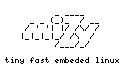

# linux kernel 3.4.113+ for Orange Pi Zero board & miZy MODs

## Features

* minimized for size- remove not used systems like hdmi and many other
* enable onboard SPI flash full support 
* onboard WiFi xr819 - xradio_wlan
* kernel lzma compression, and additional gzip variant
* initrd compression any from gzip lzma lzo xz
* some systems builded as module for more flexibility
    * i2c 
    * audio
    * ethernet - sunxi_gmac
    * ir 
    
## Get Source Prepare and Build & Clear

    mkdir /tmp/zero_builder
    cd /tmp/zero_builder

    git clone https://github.com/hyphop/miZy-linux-kernel.git
    cd miZy-linux-kernel

    ./kernel_prepare
    ./kernel_build_all

## Output

    ./bin

## Deps and cross compilation

* toolchain-arm_cortex-a9+neon_gcc-5.3.0_musl-1.1.15_eabi

its easy and automated by scripts!

## miZy 
 
miZy - open source minimalistic tiny fast embedded Linux system, (for sunxi Orange Pi Zero, another sunxi boards maybe work too )

## LINKS

- [https://github.com/hyphop/miZy-linux-kernel](https://github.com/hyphop/miZy-linux-kernel)
- [https://github.com/hyphop/miZy-uboot](https://github.com/hyphop/miZy-uboot)
- [https://hyphop.github.io/mizy/](https://hyphop.github.io/mizy/)

## ;)

